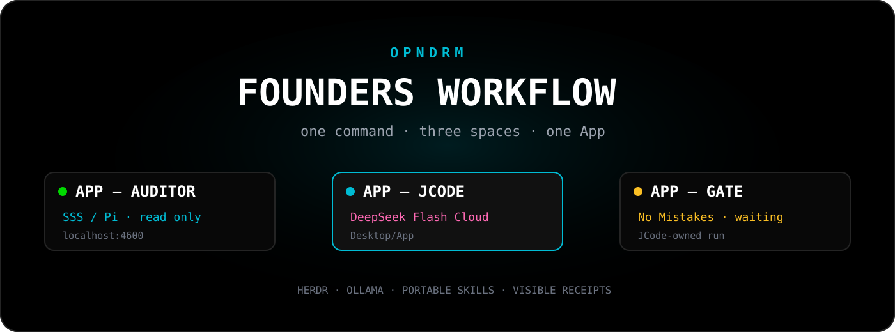

<div align="center">



<br>

<strong>Install a complete, visible agent workflow with one terminal command.</strong>

<br><br>

<a href="https://github.com/opndrm/founders/actions/workflows/validate.yml"></a>
<a href="https://github.com/opndrm/founders/pull/1"></a>
<a href="https://opndrm-founders.whiteoutdreams.chatgpt.site"></a>


</div>

---

<div align="center">

### [Open the OPNDRM Founders site →](https://opndrm-founders.whiteoutdreams.chatgpt.site)

</div>

## One App. Three spaces.

The Founders installer creates a new, initially empty `Desktop/App` folder and attaches exactly three HERDR spaces to it—matching the black, focused terminal workflow used by OPNDRM.

<table>
  <thead>
    <tr>
      <th width="25%">Space</th>
      <th width="25%">Role</th>
      <th>What happens there</th>
    </tr>
  </thead>
  <tbody>
    <tr>
      <td><strong>APP — AUDITOR</strong></td>
      <td>SSS + Pi</td>
      <td>Read-only evidence work with the live Auditor Screen at <code>localhost:4600</code>.</td>
    </tr>
    <tr>
      <td><strong>APP — JCODE</strong></td>
      <td>Coder</td>
      <td>A fresh JCode session pointed at <code>Desktop/App</code>.</td>
    </tr>
    <tr>
      <td><strong>APP — GATE</strong></td>
      <td>No Mistakes</td>
      <td>Installed and visibly waiting for a JCode-owned, authorized run.</td>
    </tr>
  </tbody>
</table>

<div align="center">
  <sub>Auditor → JCode → Gate. Three spaces only. No duplicate control plane.</sub>
</div>

## Install

<details open>
<summary><strong>macOS — Terminal</strong></summary>

```bash
curl -fsSL https://raw.githubusercontent.com/opndrm/founders/main/install.sh | bash
```

</details>

<details>
<summary><strong>Windows — PowerShell</strong></summary>

```powershell
irm https://raw.githubusercontent.com/opndrm/founders/main/install.ps1 | iex
```

HERDR's native Windows build is currently preview/beta. The installer reports that boundary before making changes.

</details>

Want to inspect the actions first?

```bash
# macOS
curl -fsSL https://raw.githubusercontent.com/opndrm/founders/main/install.sh | bash -s -- --dry-run
```

```powershell
# Windows PowerShell
& ([scriptblock]::Create((irm https://raw.githubusercontent.com/opndrm/founders/main/install.ps1))) -DryRun
```

> [!IMPORTANT]
> The installer is currently under review in [Build three-space OPNDRM workflow installer](https://github.com/opndrm/founders/pull/1). The permanent `main` commands become live after that change is merged.

## The model route

<table>
  <tr>
    <td><strong>Default</strong></td>
    <td><code>ollama/deepseek-v4-flash:0731-cloud</code></td>
    <td>JCode and the read-only Auditor</td>
  </tr>
  <tr>
    <td><strong>Hard-work fallback</strong></td>
    <td><code>ollama/minimax-m3:cloud</code></td>
    <td>Optional, owner-selected work</td>
  </tr>
  <tr>
    <td><strong>Gate</strong></td>
    <td>No independent model</td>
    <td>No Mistakes validates Git work owned by JCode</td>
  </tr>
</table>

## What the installer sets up

- Installs or verifies HERDR, JCode, Pi, Ollama, Git, Bun, `uv`, SSS, and No Mistakes using their supported installers.
- Creates `Desktop/App` without stamping framework files into it.
- Installs SSS centrally and launches its read-only Pi Auditor against the App folder.
- Starts the SSS API and dashboard at `http://localhost:4600` and requires a passing health check.
- Creates the three spaces idempotently; an existing matching space is left untouched.
- Applies the OPNDRM black, charcoal, and cyan HERDR theme and matching dark WezTerm palette.
- Installs 37 owner-approved portable Codex/Crew skills without deleting unrelated skills.
- Leaves No Mistakes idle. The installer never starts, approves, answers, aborts, or syncs a Gate run.

## The OPNDRM look

<table>
  <tr>
    <td><code>#000000</code></td>
    <td>HERDR panel background</td>
    <td><code>#111111</code></td>
    <td>Charcoal surfaces</td>
  </tr>
  <tr>
    <td><code>#171717</code></td>
    <td>WezTerm background</td>
    <td><code>#00bcd4</code></td>
    <td>Active cyan accent</td>
  </tr>
</table>

Native macOS close, minimize, and maximize controls remain visible. Existing HERDR and WezTerm configuration is backed up before the OPNDRM theme is applied.

## Safety by default

<div align="center">

| The installer does | The installer never does |
|---|---|
| Prompts before changing the machine | Copies API keys or provider tokens |
| Keeps `Desktop/App` during repair/uninstall | Copies Atomic Vault databases or trust state |
| Installs only the packaged skill manifest | Publishes caches, logs, sessions, or transcripts |
| Leaves existing matching spaces untouched | Runs No Mistakes without JCode and owner authorization |

</div>

Read the complete trust boundary in [SECURITY.md](SECURITY.md).

## Project status

- Codex Site: [OPNDRM Founders Workflow](https://opndrm-founders.whiteoutdreams.chatgpt.site)
- Installer branch: [`codex/build-opndrm-installer`](https://github.com/opndrm/founders/tree/codex/build-opndrm-installer)
- Review: [Build three-space OPNDRM workflow installer](https://github.com/opndrm/founders/pull/1)
- Compare: [review the complete installer diff](https://github.com/opndrm/founders/compare/main...codex/build-opndrm-installer)
- Validation: macOS Bash and Windows PowerShell GitHub Actions

<div align="center">

<br>

**Built for founders who want the agents visible, the roles separated, and the receipts honest.**

<sub>OPNDRM · HERDR · JCode · SSS/Pi · No Mistakes · Ollama</sub>

</div>
