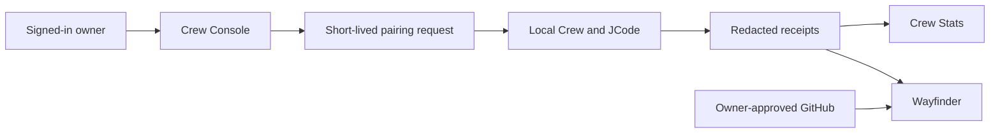
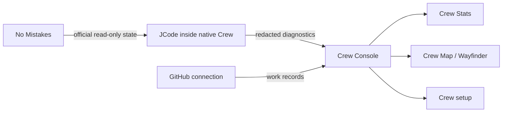

# Crew Roadmap

Use this skill to keep Open Dream Ops product planning coherent. Produce a
truthful, safety-bounded roadmap and preserve the distinction between planning,
visibility, and execution.

## Product North Star

Open Dream Ops is the personal design-engineering control room for the user's
company. It gives the owner one clear view of products, native development,
web releases, work evidence, and approvals.

Crew is a Rust-native JCode Swarm integration. It is not a generic dashboard
or a second agent harness. Crew Console is its secure web companion at
`opndrm.com/crew`.

## Non-Negotiable Boundaries

- JCode is the exclusive executor for Crew code, tests, reviews, commits,
  releases, No Mistakes operations, Crew Map publication, and official pipeline
  transitions.
- Crew Console is a web projection and owner workspace. It does not become a
  hidden remote shell, another scheduler, agent runtime, credentials vault, or
  competing Crew Map owner.
- No Mistakes remains JCode-owned. The web product may show official read-only
  status; it must never start, restart, abort, approve, recover, or send input
  to a run.
- GitHub is a connected work record, not a transport for live local diagnostics.
- Apple account, signing, certificates, TestFlight changes, submissions, and
  releases remain owner-approved actions in Apple-controlled surfaces.
- Never imply that a web view opened or controlled a local JCode session unless
  a paired local Crew app visibly accepted the request.

## Product Surfaces

### Open Dream Ops

The parent site at `opndrm.com`. It introduces the studio and routes to Crew,
Frankly One, ADAM, and later products. Keep each product on its own path.

### Crew

The account and setup surface at `opndrm.com/crew`.

- Authenticate with an established one-time-code provider.
- Create or join teams, invite members, and view team ownership.
- Pair a local Mac through short-lived, single-use, revocable device approval.
- Show connection health, compatibility, approved scope, and device revoke.
- Request a local **Open Session** deep link only for an already advertised,
  paired session on the current Mac.

### Crew Stats

The truthful diagnostics surface.

- Project only safe, redacted status receipts from the native Crew/JCode seam.
- Show device health, session/agent lifecycle, safe task progress, compatibility,
  warnings, and data freshness.
- Label every fact by source and state: current, cached, stale, offline, or
  unavailable.
- Never show prompts, source code, scrollback, private paths, environment data,
  credentials, customer data, or hidden command history by default.

### Crew Map — Wayfinder

Crew Map is **Wayfinder**, the read-only visual record of approved work.

- Render the latest official JCode-published Mermaid diagram.
- Show the connected GitHub identity/repository state after owner approval.
- Link relevant issues, pull requests, milestones, commits, and release
  checkpoints only where authorization permits.
- Show append-only running receipts with source, time, team, work object,
  freshness, integrity reference, redaction class, and state.
- Never let a browser user directly edit or forge an official Crew Map record.

## Secure Native-to-Web Flow

1. A user signs in and creates or joins a team.
2. Crew Console creates a short-lived pairing request.
3. The local app visibly displays account, team, scope, and expiry before the
   owner approves it.
4. The paired local app publishes a small, validated, redacted status snapshot.
5. The Console displays that snapshot only to the authorized team.
6. A deep link may ask the local app to open an approved visible session; the
   local app validates and accepts or rejects it.

## Receipt Contract

Plan a versioned projection contract. Every event must include:

- source and authoritative/informational classification;
- team and device ownership;
- schema version and timestamp;
- data freshness and retention rule;
- redaction classification;
- stable type and integrity/correlation reference.

Use separate receipt types for device pairing/revocation, session lifecycle,
diagnostic snapshots, JCode-published map snapshots, GitHub connection state,
and receipt creation/supersession.

Reject unknown, malformed, expired, cross-team, or unauthorized events.

## No Mistakes Visibility Slice

Treat this as **slice two**, after the first pairing/projection slice works.

Build a read-only web projection that lets an owner understand a current run
without normally needing `no-mistakes attach` for observation. Render a Mermaid
run diagram with:

- project/run label and freshness;
- current stage and safe summary;
- completed, active, waiting, blocked, failed, and cancelled nodes;
- linked receipts and next-owner label;
- explicit delayed, disconnected, or unavailable state.

Keep the native attach view as fallback until web evidence proves parity for
read-only visibility. Do not add web controls for pipeline operations.

## Unified Diagnostics Path

Keep the sources distinct. JCode/Crew provides local operational facts, No
Mistakes provides official read-only run state through its approved native seam,
and GitHub provides repository/work information. The Console labels each source
instead of silently merging them into invented progress.

## Web Release Lane

Use this for Open Dream product websites:

1. Build/revise product experience in Codex Sites or the product’s web source.
2. Save the product to its own GitHub repository.
3. Let Vercel create a preview deployment.
4. Show preview, build health, review state, and release receipt in Console.
5. Require owner approval before production deployment to the intended
   `opndrm.com` path.

Never treat a Vercel deploy as proof of an Apple release, or vice versa.

## Apple Development Lane

Keep Apple as a later, separate lane. The owner has an Apple Developer Program
membership, but Crew should not handle Apple secrets or submit releases without
clear approval.

- Connect an Apple app’s GitHub repository to the native build/CI workflow.
- Project safe build, test, archive, TestFlight, and App Store readiness.
- Keep certificates, private keys, payment/banking details, and Apple account
  credentials outside Crew Console.
- Require owner approval at the Apple surface before external TestFlight changes,
  App Store submission, or release.

## Local-First AI Lane

Build Crew as a local-first **agent system**, not as a promise to train one
giant swarm model.

- Use local models for fast, private, offline tasks on Apple Silicon.
- Keep stronger hosted models optional for tasks that require them.
- Make model routing deliberate, visible, replaceable, and receipt-backed.
- Consider fine-tuning only after collecting clean, authorized, evaluated data.
- Unsloth may be a later training/fine-tuning tool; it is not the core Crew
  architecture.

## Optional Kimi Provider Lane

Use Kimi only as an optional bounded provider, never as the authority that takes
over Crew.

1. Use a model-provider adapter for approved prompts and returned results.
2. Optionally launch a Kimi swarm job in an isolated workspace for bounded
   parallel research, batch work, or code review.
3. Import only the final artifact and safe job receipts into Crew Console.
4. Display its origin, status, usage label, and output beside JCode work.

Do not let Kimi operate Crew sessions, local terminals, No Mistakes, secrets, or
Crew Map publication. Do not assume Kimi’s product swarm is an API capable of
controlling the existing Crew swarm; verify the supported integration surface
before design or implementation.

## V1 Boundary

Treat the current native Crew V1 as the priority. Do not pull the dashboard,
Console, web-release, Apple, or model-provider ideas into V1 just because they
are valuable. They are recorded below as post-V1 expansion ideas.

For V1 planning, preserve the existing Crew phase gates: research first, one
proposed slice, then Captain approval before implementation or side effects.

## Post-V1 / Slice Two Expansion Backlog

All items in this section are design direction and future ideas. They are not
permission to implement, connect accounts, train models, publish websites, or
operate JCode/No Mistakes. Start only when the Captain explicitly selects a
smallest slice after V1.

### Current running Slice Two list

These are the remaining recorded ideas, arranged in the order that keeps the
first useful release safe and legible:

1. **Crew Console vertical slice:** one signed-in owner, one team, one
   locally-approved short-lived pairing, one redacted diagnostic snapshot, one
   Mermaid map projection, and an honest offline/disconnected state.
2. **Crew Stats and Wayfinder:** read-only diagnostics, freshness labeling,
   native JCode-published Mermaid snapshots, GitHub connection state, and
   append-only running receipts.
3. **No Mistakes visibility:** a read-only run diagram and official state
   receipts in the browser, while native attach remains the fallback.
4. **Team and session experience:** invitations, roles, revocable paired Macs,
   session inventory, and locally-approved deep links into already-paired
   visible sessions.
5. **Open Dream release desk:** product source to GitHub to Vercel preview to
   owner-approved production, with domain health and release receipts.
6. **Owner-only visual site notes:** click a rendered section, create a
   structured change request tied to the element, and preserve the request as
   a private work item rather than editing live code from the browser.
7. **Apple development lane:** safe native build/TestFlight/App Store readiness
   projection, with Apple credentials, signing, and releases kept in
   owner-approved Apple surfaces.
8. **Local-first agent lane:** evaluate Apple-Silicon local models and MLX;
   consider training/fine-tuning only with authorized evaluated data.
9. **Optional Kimi adapter:** isolated, bounded provider jobs with imported
   artifacts and receipts; never give Kimi authority over Crew, terminals,
   No Mistakes, secrets, or Wayfinder publication.
10. **Commercial foundation:** paid plans, product sales, support, privacy,
    retention/deletion, incident response, and explicitly approved payment
    integrations after team isolation and diagnostics are proven.

### A. Crew Console foundation

1. Research the native JCode/Crew seams.
2. Propose exactly one small safe vertical slice: one user, one team, one local
   pairing, one redacted diagnostic snapshot, one official Mermaid map
   projection, and one honest disconnected state.
3. Stop for Captain approval.

### B. No Mistakes visibility

After the Console foundation is proven, project official read-only No Mistakes
run status into Crew Stats and Wayfinder. Use Mermaid to explain active,
completed, waiting, blocked, failed, and cancelled states plus receipts and
next owner. Keep native `no-mistakes attach` as the fallback until the browser
projection is demonstrably trustworthy.

### C. Teams, sessions, and receipts

Add invitations, roles, revocable paired devices, safe session inventory, and
locally approved deep links. Build Wayfinder receipt history as an append-only
record of published work—not a tool for browser-side execution.

### D. GitHub and release visibility

Add an owner-approved GitHub connection. Render repository identity, issues,
pull requests, commits, workflows, and milestones with clear source labels.
Then build the website release lane: Codex Sites/product source to product
repository to Vercel preview to owner-approved production release under the
appropriate `opndrm.com` path.

### E. Personal design-engineering dashboard

Evolve Open Dream Ops into the owner’s personal company workflow dashboard.
Keep products distinct—Crew, Frankly One, ADAM, and later products—while giving
the owner one view of product setup, diagnostics, release evidence, and
approvals. Include an owner-only visual site-note/edit-mode concept: click a
rendered section, attach a structured change request, and keep that request
private and tied to the selected element.

### F. Apple product lane

After the Console and web lanes are reliable, add a separate Apple development
lane: repository, native build/test/archive status, TestFlight readiness, App
Store readiness, and release receipts. Preserve Apple signing/account/submission
approval boundaries.

### G. Local-first and optional provider research

Explore local models, MLX, and later fine-tuning with Unsloth only after there
is clean authorized data and a clear evaluation plan. Evaluate Kimi as an
optional bounded model/swarm-job provider, never a replacement for Crew/JCode
authority. Do not assume that its product swarm can remotely control Crew.

### H. Commercial and financial product ideas

After the security, team isolation, pairing, and visibility foundation is
proven, define paid plans, product sales, support, privacy, retention/deletion,
incident response, and owner-approved payment integrations. Do not add billing
or bank/account operations before that foundation exists.

## Planning Rules

- Begin each proposal with the user outcome and the smallest feasible slice.
- Separate verified facts from design assumptions.
- State the owner of each operation and the data flow before proposing a build.
- Prefer supported, versioned interfaces and established authentication/storage
  systems over custom credential or cryptography schemes.
- Require tenant isolation, validated payloads, redaction at source, rate limits,
  audit trails, revocation, and deletion/retention rules before production.
- Make offline, stale, blocked, unauthorized, incompatible, and unavailable
  states deliberate UI states.
- Do not broaden a requested slice into remote execution, billing, model
  training, or public sharing without Captain approval.
- For a Crew code or pipeline change, prepare a bounded Captain-authorized
  request for the visible JCode session. Do not implement Crew code directly.

## Required Evidence

Do not call a roadmap phase complete until evidence demonstrates:

1. a user sees only authorized team data;
2. an unpaired device cannot read or publish team state;
3. pairing is single-use, expiring, revocable, and locally approved;
4. diagnostics are redacted and freshness is clear;
5. browser Mermaid maps match official published JCode snapshots;
6. session deep links cannot open sessions on an unpaired/different Mac;
7. website controls cannot operate JCode or No Mistakes;
8. GitHub data is team-scoped and source-labeled;
9. web and Apple release states remain separate;
10. the Captain approves the visible flow and language.
